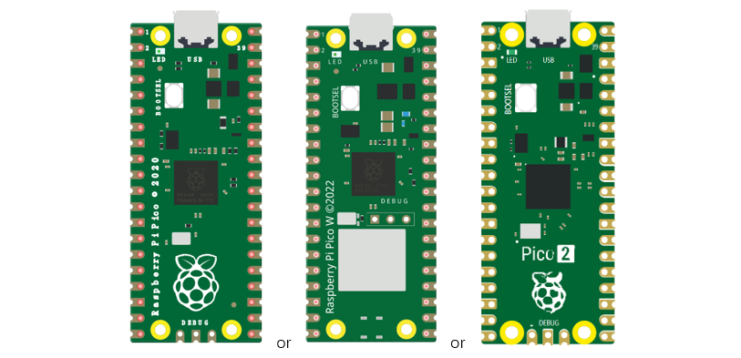
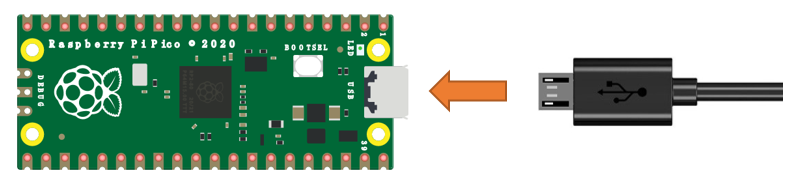
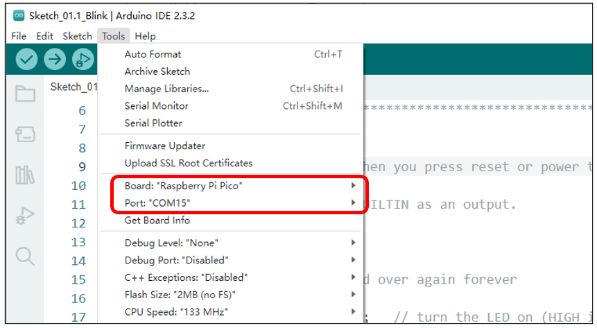
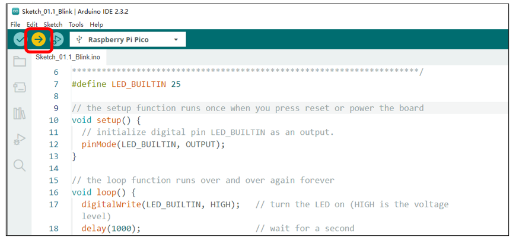

##############################################################################
Chapter 1 LED (Important)
##############################################################################

.. note::

    :red:`Raspberry Pi Pico, Raspberry Pi Pico W and Raspberry Pi Pico 2 only differ by one wireless function, and are almost identical in other aspects. In this tutorial, except for the wireless function, other parts use Raspberry Pi Pico's map for tutorial demonstration.`

This chapter is the Start Point in the journey to build and explore Pico electronic projects. We will start with simple “Blink” project.

Project 1.1 Blink
**************************************

In this project, we will use Raspberry Pi Pico to control blinking a common LED.

If you have not installed Arduino IDE, you can click :ref:`Here <Programming>`.

If you have not uploaded firmware for Pico, you can click :ref:`Here <Firmware>` to upload. 

Component List
=======================================

.. list-table:: 
   :width: 100%
   :align: center

   * -  Raspberry Pi Pico(or Pico W or Pico 2)x1
   * -  |Chapter01_00|
   * -  USB cable x1
   * -  |Chapter01_01|

Power
----------------------------

Raspberry Pi Pico requires 5V power supply. You can either connect external 5V power supply to Vsys pin of Pico or connect a USB cable to the onboard USB base to power Pico.

In this tutorial, we use USB cable to power Pico and upload sketches.

Sketch
============================

The onboard LED of Raspberry Pi Pico is controlled by GP25. When GP25 outputs high level, LED lights up; when it outputs low, LED lights off. You can open the provided code:

Freenove_Ultimate_Starter_Kit_for_Raspberry_Pi_Pico\\C\\Sketches\\Sketch_01.1_Blink.

Before uploading code to Pico, please check the configuration of Arduino IDE. 

Click Tools, make sure Board and Port are as follows:

Click “Upload” to upload the sketch to Pico.

:red:`If you have any concerns, please contact us at support@freenove.com`

Pico's on-board LED lights on and off every 1s, flashing cyclically. 

